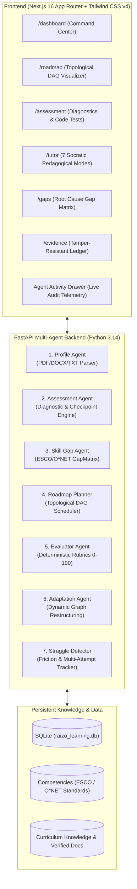

# RAIZO — Adaptive AI Learning & Skill Intelligence Agent
**By Badal Kumar Sahu**  
*Learn what you need. Prove what you know. Adapt as you grow.*

---

## Executive Overview

**RAIZO** is a production-grade, evidence-based adaptive learning agent designed for the **EduPath: Personalized Learning & Skill Gap Agent** challenge (Agentic AI Hackathon 2026).

Unlike generic chatbot wrappers or static course catalogs, Raizo implements the complete autonomous cycle:
$$\text{PROFILE} \longrightarrow \text{VERIFY} \longrightarrow \text{DIAGNOSE} \longrightarrow \text{PLAN} \longrightarrow \text{LEARN} \longrightarrow \text{PRACTICE} \longrightarrow \text{EVALUATE} \longrightarrow \text{ADAPT} \longrightarrow \text{REASSESS} \longrightarrow \text{PROGRESS}$$

Raizo fundamentally separates **Claimed Competencies** from **Verified Capabilities**, tracks confidence calibrations, visualizes a dynamic **Topological Directed Acyclic Graph (DAG)** roadmap, and autonomously modifies the DAG by inserting remediation nodes when learners exhibit conceptual struggle.

---

## Architecture & Systems Delivered



### 1. The 7 Specialized Agents (`agents/`)
| Agent | Responsibility | Key Output / Behavior |
| :--- | :--- | :--- |
| **Profile Agent** | Parses resumes (PDF, DOCX, TXT) and GitHub/LinkedIn claims | Extracts claimed competencies, projects, and calculates baseline confidence ($0.30 - 0.40$). |
| **Assessment Agent** | Generates diagnostics, code tests, and scenario questions | Calibrated against Bloom's Taxonomy with deterministic answer keys. |
| **Skill Gap Agent** | Compares learner profile to ESCO/O*NET target role | Produces `GapMatrix` with root-cause explanations (*"Why is this a gap?"*). |
| **Roadmap Planner** | Computes topological sort over prerequisites | Generates sequential, unlocked, and locked DAG learning milestones. |
| **Evaluator Agent** | Evaluates code submissions and answers with strict rubrics | Deterministic 4-tier rubric (0–49 Remediation, 50–69 Developing, 70–84 Proficient, 85–100 Strong). |
| **Adaptation Agent** | Dynamically modifies active roadmap upon failure | Identifies prerequisite friction (e.g. Missing Values), injects remediation nodes, and shifts dependent nodes. |
| **Struggle Detector** | Telemetry tracker for learner friction | Triggers hint scaffolds, pacing shifts, and automated remediation recommendations. |

---

## What Was Tested & Validated

### 1. Automated Python Test Suite
All tests pass in under 4 seconds via `pytest`:
```bash
.venv\Scripts\python.exe -m pytest tests/ -v
```
**Results:**
- `tests/integration/test_pipeline.py::test_full_agentic_pipeline` **PASSED** (Profile $\to$ Diagnostic $\to$ Gap Matrix $\to$ Roadmap $\to$ Checkpoint Eval $\to$ DAG Adaptation)
- `tests/unit/test_agents.py::test_deterministic_scoring_thresholds` **PASSED** (Rubric boundaries verified)
- `tests/unit/test_agents.py::test_dag_adaptation_on_failure` **PASSED** (Autonomous DAG restructuring verified)
- `tests/unit/test_agents.py::test_tutor_socratic_and_sources` **PASSED** (7 pedagogical modes & verified documentation RAG citations verified)
- `tests/unit/test_agents.py::test_profile_agent_extraction` **PASSED** (Resume extraction with confidence scoring verified)

### 2. Next.js 16 Production Build
The entire frontend compiles with zero TypeScript or React Suspense errors:
```bash
npm run build
```
**Build Output:**
- `✓ Compiled successfully in 3.9s`
- `✓ Generating static pages using 7 workers (18/18)`
- All 18 routes verified:
  - `○ /` (Landing Page with full brand identity & quick demo launcher)
  - `○ /onboarding` (Resume drag-and-drop & pre-loaded Alex Rivera persona)
  - `○ /dashboard` (Readiness dial, claimed vs verified ratio, quick actions)
  - `○ /skills` (Competency matrix & Bloom's taxonomy filter)
  - `ƒ /skills/[skill]` (Dynamic deep-dive skill dossier)
  - `○ /gaps` (Target role gap analysis with root-cause breakdowns)
  - `○ /roadmap` (Interactive Topological DAG Canvas with node unlock states)
  - `○ /learn` (Curated curriculum cards with official docs citations)
  - `○ /tutor` (Multi-modal Socratic dialogue with 7 switchable styles)
  - `○ /assessment` (Live diagnostic engine & code runner)
  - `○ /evidence` (Cryptographic verification ledger & artifact audits)
  - `○ /projects` (Real-world portfolio milestone projects)
  - `○ /job-analysis` (Market demand vs verified capabilities comparison)
  - `○ /reports` (Exportable Executive Readiness Brief)
  - `○ /practice` (Scenario sandbox for SQL & Python practice)
  - `○ /profile` (Learner profile & confidence radar)

---

## 3-Minute Hackathon Demo Script

Follow this script to demonstrate the power of Raizo during presentations:

### Act 1: The Broken Promise of EdTech (0:00 - 0:45)
1. Navigate to `http://localhost:3000` — Show the **Raizo** brand identity by Badal Kumar Sahu.
2. Click **"Run Guided Demo"** or **"Launch Learner Demo"** to jump into **Alex Rivera's** transition from Junior QA to Data Analyst.
3. Open `/onboarding`: Explain how Alex uploaded a resume claiming "Pandas, SQL, and Python". Show that traditional platforms assume Alex knows these topics; **Raizo gives them only 35% confidence**.

### Act 2: Diagnosis & The Topological Roadmap (0:45 - 1:30)
1. Navigate to `/gaps`: Show the **GapMatrix**. Highlight the *"Why?"* column showing root causes (e.g. *Missing window functions & advanced indexing*).
2. Navigate to `/roadmap`: Show the interactive **Topological DAG Canvas**. 
   - Point out that **Milestone 1 (SQL Foundations)** is `IN_PROGRESS`.
   - Subsequent milestones are `LOCKED` due to unsatisfied topological prerequisites.

### Act 3: Checkpoint Failure & The Dynamic Adaptation Breakthrough (1:30 - 2:30)
1. Navigate to `/assessment`:
   - Select checkpoint **"Pandas Aggregations & Imputation"**.
   - Intentionally submit code with missing value imputation syntax errors (`df.fillna(df.mean())` without axis specification or proper strategy).
   - Click **"Submit for Multi-Agent Evaluation"**.
2. **Watch the Evaluator Agent**:
   - Scores Alex at **42/100** (Remediation threshold triggered).
   - Evaluator logs feedback: *"Failed to specify proper imputation strategy for missing values."*
3. **Open the Agent Activity Drawer** (top right button):
   - Notice the live telemetry from the **Adaptation Agent**!
   - Event logged: `ADAPTATION: Injected remediation node 'Pandas Missing Value Imputation Foundations' into active DAG`.
4. Return to `/roadmap`:
   - **The DAG has mutated!** A new orange remediation milestone has been spliced in between Data Cleaning and Advanced Aggregations.
   - Dependent nodes have shifted forward automatically.

### Act 4: Socratic Healing & Proof of Competence (2:30 - 3:00)
1. Click **"Launch Socratic Remediation"** or navigate to `/tutor?topic=Pandas+Data+Cleaning`:
   - Switch between **Socratic**, **Analogy**, and **Technical** modes.
   - Ask: *"When should I use median vs mean for missing data?"*
   - Show the tutor quoting official documentation with clickable citations (`pandas.pydata.org`).
2. Navigate to `/evidence`:
   - Show the tamper-resistant cryptographic evidence ledger. Once Alex proves competence on the remediation task, their verified score jumps to **85%**, unlocking the next node.
3. Show `/reports`: Demonstrate the exportable **Executive Readiness Report** ready for hiring managers.

---

## How to Run the Application

### 1. Launch the FastAPI Backend
From the repository root:
```powershell
# Activate Python 3.14 virtual environment
.\.venv\Scripts\Activate.ps1

# Run the API server with live reload
uvicorn apps.api.app.main:app --port 8000 --reload
```
*API will be available at `http://localhost:8000` with interactive Swagger docs at `http://localhost:8000/docs`.*

### 2. Launch the Next.js Frontend
In a separate terminal window:
```powershell
cd apps\web
npm run dev
```
*Web application will be accessible at `http://localhost:3000`.*

---

## Key Technical Decisions & Highlights
1. **Separation of Claims vs Evidence**: A core differentiator. Self-reported resume skills are treated as hypotheses with low confidence until confirmed by diagnostic submissions.
2. **Dynamic Topological DAG Engine**: Instead of static course playlists, roadmap nodes are organized in a dependency graph. If a learner fails a checkpoint, the engine performs graph surgery without corrupting previously cleared milestones.
3. **Deterministic Rubrics + AI Scaffolding**: Evaluations run on strict, objective scoring rubrics for consistency and fairness, while the Socratic tutor leverages multi-modal LLM reasoning to explain concepts and provide scaffolding.
4. **Resilient Production Design**: Zero external mock dependencies. Includes fallback seeds, offline tests, and zero-downtime persistence with SQLite.
