# RAIZO — Adaptive AI Learning & Skill Intelligence Agent
**By Badal Kumar Sahu**  
*Learn what you need. Prove what you know. Adapt as you grow.*

---

## Executive Overview

**RAIZO** is a production-grade, evidence-based adaptive learning agent created by Badal Kumar Sahu for the **EduPath: Personalized Learning & Skill Gap Agent** challenge (Agentic AI Hackathon 2026).

Unlike generic chatbot wrappers or static course catalogs, Raizo implements the complete autonomous cycle:
$$\text{PROFILE} \longrightarrow \text{VERIFY} \longrightarrow \text{DIAGNOSE} \longrightarrow \text{PLAN} \longrightarrow \text{LEARN} \longrightarrow \text{PRACTICE} \longrightarrow \text{EVALUATE} \longrightarrow \text{ADAPT} \longrightarrow \text{REASSESS} \longrightarrow \text{PROGRESS}$$

Raizo fundamentally separates **Claimed Competencies** from **Verified Capabilities**, tracks confidence calibrations, visualizes a dynamic **Topological Directed Acyclic Graph (DAG)** roadmap, and autonomously modifies the DAG by inserting remediation nodes when learners exhibit conceptual struggle.

---

## Real Resume Upload & Document Intelligence Architecture

A core innovation in RAIZO is the **Genuine Resume Upload Pipeline & Private Document Storage Engine**. Rather than using mock upload animations or fake entity generation, RAIZO implements real end-to-end document parsing, cryptographic verification, and learner review:

```mermaid
flowchart TD
    A[Browser: PDF / DOCX / TXT Drag & Drop] -->|Validation: < 10MB, non-empty, genuine ext| B[POST /api/profile/upload-resume]
    B --> C[Compute SHA-256 Hash]
    B --> D[Private Storage: storage/users/{user_id}/resumes/{uuid}.{ext}]
    D --> E[Document Parser: PyPDF2 / python-docx / txt]
    E -->|Scanned / Image PDF or < 50 chars text| F[ScannedPdfException: 422 Honest Rejection]
    E -->|Genuine Text Content| G[Profile Agent: Categorized Skill & Entity Extraction]
    G --> H[Record in documents table: sha256, path, status, extracted_json]
    H --> I[Unverified Review Draft: 9 Categorized Skill Buckets, Confidence 0.30 - 0.40]
    I --> J[User Review & Edit Step: ExtractedProfileReview Component]
    J -->|POST /api/profile/resume/{id}/confirm| K[Learner Profile Stored: Claims Marked 'Unverified']
    K --> L[Diagnostic Assessment Agent Activated]
```

### Key Engineering Features of the Resume Pipeline:
1. **Real Private File Storage**: Resumes are stored on disk in isolated user directories (`storage/users/{user_id}/resumes/`), isolated per user account and excluded from version control via `.gitignore`.
2. **Cryptographic SHA-256 Integrity**: Every document computes a SHA-256 hash immediately upon upload, recorded in the `documents` SQLite table for tamper-evident auditability.
3. **Honest Scanned PDF Rejection**: If an uploaded PDF has zero extractable text (or less than 50 characters of content), RAIZO raises `ScannedPdfException` and returns HTTP 422 with the exact error:
   > *"We could not extract enough text from this PDF. This may be a scanned/image-based resume. Please upload a text-based PDF or DOCX."*
   RAIZO explicitly refuses to fabricate or hallucinate a resume profile from an unreadable scan.
4. **9-Category Skill Extraction**: Skills are mapped into 9 standard technical buckets:
   - Languages & Frameworks
   - Cloud & Infrastructure
   - Data & Analytics
   - Machine Learning & AI
   - Developer Tools
   - Database & Storage
   - Testing & QA
   - Soft Skills & Leadership
   - Domain Knowledge
5. **Separation of Claims vs. Evidence**: Every extracted skill is categorized with `is_verified: false` and a conservative confidence score ($0.30 - 0.40$). A prominent amber banner reminds the learner that self-reported claims must be verified via diagnostic checkpoints before impacting role readiness.
6. **User Isolation & Authentication**: Full signup (`/signup`), signin (`/login`), and profile management (`/settings`) with PBKDF2/SHA-256 password hashing and Bearer tokens, while seamlessly supporting a 1-click **Demo Learner (Alex Rivera)** experience for hackathon judges.

---

## The 7 Specialized Autonomous Agents (`agents/`)

```mermaid
flowchart TB
    subgraph UI ["Frontend (Next.js 16 App Router + Tailwind CSS v4)"]
        Dashboard["/dashboard (Command Center)"]
        Onboarding["/onboarding (Resume Upload & Review)"]
        RoadmapCanvas["/roadmap (Topological DAG Visualizer)"]
        AssessmentUI["/assessment (Diagnostics & Code Tests)"]
        TutorUI["/tutor (7 Socratic Pedagogical Modes)"]
        GapsUI["/gaps (Root Cause Gap Matrix)"]
        EvidenceUI["/evidence (Tamper-Resistant Ledger)"]
        SettingsUI["/settings (Resume Management & Actions)"]
        AgentDrawer["Agent Activity Drawer (Live Audit Telemetry)"]
    end

    subgraph API ["FastAPI Multi-Agent Backend (Python 3.14)"]
        ProfileAg["1. Profile Agent\n(PDF/DOCX Parser & SHA-256)"]
        AssessAg["2. Assessment Agent\n(Diagnostic & Checkpoint Engine)"]
        GapAg["3. Skill Gap Agent\n(ESCO/O*NET GapMatrix)"]
        RoadmapAg["4. Roadmap Planner\n(Topological DAG Scheduler)"]
        EvalAg["5. Evaluator Agent\n(Deterministic Rubrics 0-100)"]
        AdaptAg["6. Adaptation Agent\n(Dynamic Graph Restructuring)"]
        StruggleAg["7. Struggle Detector\n(Friction & Multi-Attempt Tracker)"]
    end

    subgraph Storage ["Persistent Knowledge & Data"]
        PrivateDisk[("Disk: storage/users/{id}/resumes/")]
        DB[("SQLite: raizo_learning.db")]
        ESCO[("Competencies: ESCO / O*NET Standards")]
        RAG[("Verified Documentation & Official Guides")]
    end

    UI <--> API
    API <--> Storage
```



| Agent | Responsibility | Key Output / Behavior |
| :--- | :--- | :--- |
| **Profile Agent** | Parses resumes (PDF, DOCX, TXT) and GitHub/LinkedIn claims | Extracts claimed competencies, personal details, projects, computes SHA-256, and assigns baseline confidence ($0.30 - 0.40$). |
| **Assessment Agent** | Generates diagnostics, code tests, and scenario questions | Calibrated against Bloom's Taxonomy with deterministic answer keys. |
| **Skill Gap Agent** | Compares learner profile to ESCO/O*NET target role | Produces `GapMatrix` with root-cause explanations (*"Why is this a gap?"*). |
| **Roadmap Planner** | Computes topological sort over prerequisites | Generates sequential, unlocked, and locked DAG learning milestones. |
| **Evaluator Agent** | Evaluates code submissions and answers with strict rubrics | Deterministic 4-tier rubric (0–49 Remediation, 50–69 Developing, 70–84 Proficient, 85–100 Strong). |
| **Adaptation Agent** | Dynamically modifies active roadmap upon failure | Identifies prerequisite friction (e.g. Missing Values), injects remediation nodes, and shifts dependent nodes. |
| **Struggle Detector** | Telemetry tracker for learner friction | Triggers hint scaffolds, pacing shifts, and automated remediation recommendations. |

---

## Verification & Testing Ledger

### 1. Automated Python Test Suite (100% Passing)
```bash
.\.venv\Scripts\python.exe -m pytest tests/ -v
```
**Results:**
- `tests/integration/test_pipeline.py::test_full_agentic_pipeline` **PASSED** (Full autonomous loop from Profile $\to$ Diagnostic $\to$ Gap Matrix $\to$ Roadmap $\to$ Checkpoint Eval $\to$ DAG Adaptation)
- `tests/unit/test_agents.py::test_deterministic_scoring_thresholds` **PASSED** (Rubric boundaries verified)
- `tests/unit/test_agents.py::test_dag_adaptation_on_failure` **PASSED** (Autonomous DAG restructuring verified)
- `tests/unit/test_agents.py::test_tutor_socratic_and_sources` **PASSED** (7 pedagogical modes & verified documentation RAG citations verified)
- `tests/unit/test_agents.py::test_profile_agent_extraction` **PASSED** (Resume extraction with confidence scoring verified)
- `tests/unit/test_resume_pipeline.py::test_auth_signup_and_isolation` **PASSED** (Secure signup, login, and isolated user records verified)
- `tests/unit/test_resume_pipeline.py::test_resume_upload_and_sha256` **PASSED** (Real file upload, SHA-256 integrity, and profile review extraction verified)
- `tests/unit/test_resume_pipeline.py::test_scanned_pdf_rejection` **PASSED** (Zero-text scanned PDF honestly rejected with HTTP 422 verified)

**Status:** 8 passed in 3.81s with zero failures.

---

### 2. Next.js 16 Production Build (22 Routes Pre-Rendered)
```bash
npm run build
```
**Build Output:**
- `✓ Compiled successfully in 10.9s`
- `✓ Generating static pages using 7 workers (22/22) in 5.7s`
- Zero TypeScript compiler errors (`tsc --noEmit`).

**All 22 Application Routes Verified:**
- `○ /` (Landing Page with full brand identity & quick demo launcher)
- `○ /_not-found` (Custom 404 handler)
- `○ /onboarding` (Resume Dropzone with 6 states & Extracted Profile Review)
- `○ /login` (Learner Sign In with 1-click Demo Account Launcher)
- `○ /signup` (New Learner Registration with password hashing)
- `○ /settings` (Active Resume management, Replace/Reprocess/Delete actions, Data Reset)
- `○ /dashboard` (Readiness dial, claimed vs verified ratio, quick actions)
- `○ /skills` (Competency matrix & Bloom's taxonomy filter)
- `ƒ /skills/[skill]` (Dynamic deep-dive skill dossier)
- `○ /gaps` (Target role gap analysis with root-cause breakdowns)
- `○ /roadmap` (Interactive Topological DAG Canvas with node unlock states)
- `ƒ /roadmap/[node]` (Milestone deep-dive, prerequisite tree, and learning resources)
- `○ /learn` (Curated curriculum cards with official docs citations)
- `○ /tutor` (Multi-modal Socratic dialogue with 7 switchable pedagogical styles)
- `○ /assessment` (Live diagnostic engine & code runner)
- `ƒ /assessment/[id]` (Dedicated assessment interface with SQL/Python editor)
- `○ /evidence` (Cryptographic verification ledger & artifact audits)
- `○ /projects` (Real-world portfolio milestone projects)
- `ƒ /projects/[id]` (Interactive capstone project workspace & repo linking)
- `○ /job-analysis` (Market demand vs verified capabilities comparison)
- `○ /reports` (Exportable Executive Readiness Brief)
- `○ /results` (Historical assessment and evaluation submission log)

---

## 3-Minute Hackathon Demo Script

Follow this script to demonstrate the power of Raizo during presentations:

### Act 1: Real Resume Upload & The Unverified Claim (0:00 - 0:45)
1. Open `http://localhost:3000` — Show the **Raizo** brand identity by Badal Kumar Sahu.
2. Click **"Get Started"** or navigate to `/onboarding`.
3. Demonstrate the **Resume Dropzone**:
   - Drag and drop a real PDF resume or use the pre-loaded Alex Rivera profile.
   - Show the 6-state progress checklist: *Validating file $\to$ Calculating SHA-256 hash $\to$ Extracting text $\to$ Categorizing 9 skill buckets*.
4. Reveal the **Extracted Profile Review** card:
   - Highlight the amber warning banner: *"Extracted claims have low baseline confidence (0.35) and are marked Unverified until confirmed by diagnostic checkpoints."*
   - Show the 9 organized skill buckets (Languages, Cloud, Data, ML, DB, etc.) and edit a skill live.
   - Click **"Confirm & Continue to Diagnosis"**.

### Act 2: Diagnosis & The Topological Roadmap (0:45 - 1:30)
1. Navigate to `/gaps`: Show the **GapMatrix**. Highlight the *"Why?"* column showing root causes (e.g. *Missing window functions & advanced indexing*).
2. Navigate to `/roadmap`: Show the interactive **Topological DAG Canvas**. 
   - Point out that **Milestone 1 (SQL Foundations)** is `IN_PROGRESS`.
   - Subsequent milestones are `LOCKED` due to unsatisfied topological prerequisites.

### Act 3: Checkpoint Failure & The Dynamic Adaptation Breakthrough (1:30 - 2:30)
1. Navigate to `/assessment`:
   - Select checkpoint **"Pandas Aggregations & Imputation"**.
   - Intentionally submit code with missing value imputation syntax errors (`df.fillna(df.mean())` without axis specification or proper strategy).
   - Click **"Submit for Multi-Agent Evaluation"**.
2. **Watch the Evaluator Agent**:
   - Scores Alex at **42/100** (Remediation threshold triggered).
   - Evaluator logs feedback: *"Failed to specify proper imputation strategy for missing values."*
3. **Open the Agent Activity Drawer** (top right button):
   - Notice the live telemetry from the **Adaptation Agent**!
   - Event logged: `ADAPTATION: Injected remediation node 'Pandas Missing Value Imputation Foundations' into active DAG`.
4. Return to `/roadmap`:
   - **The DAG has mutated!** A new orange remediation milestone has been spliced in between Data Cleaning and Advanced Aggregations.
   - Dependent nodes have shifted forward automatically.

### Act 4: Socratic Healing & Proof of Competence (2:30 - 3:00)
1. Click **"Launch Socratic Remediation"** or navigate to `/tutor?topic=Pandas+Data+Cleaning`:
   - Switch between **Socratic**, **Analogy**, and **Technical** modes.
   - Ask: *"When should I use median vs mean for missing data?"*
   - Show the tutor quoting official documentation with clickable citations (`pandas.pydata.org`).
2. Navigate to `/evidence`:
   - Show the tamper-resistant cryptographic evidence ledger. Once Alex proves competence on the remediation task, their verified score jumps to **85%**, unlocking the next node.
3. Show `/settings`:
   - Display the active resume card showing filename, file size, SHA-256 hash, upload timestamp, and actions to Replace, Reprocess, or Delete.
4. Show `/reports`: Demonstrate the exportable **Executive Readiness Report** ready for hiring managers.

---

## How to Run the Application

### 1. Launch the FastAPI Backend
From the repository root:
```powershell
# Run the API server with live reload
.\.venv\Scripts\uvicorn.exe apps.api.app.main:app --port 8000 --reload
```
*API will be available at `http://localhost:8000` with interactive Swagger docs at `http://localhost:8000/docs`.*

### 2. Launch the Next.js Frontend
In a separate terminal window:
```powershell
cd apps\web
npm run dev
```
*Web application will be accessible at `http://localhost:3000`.*
